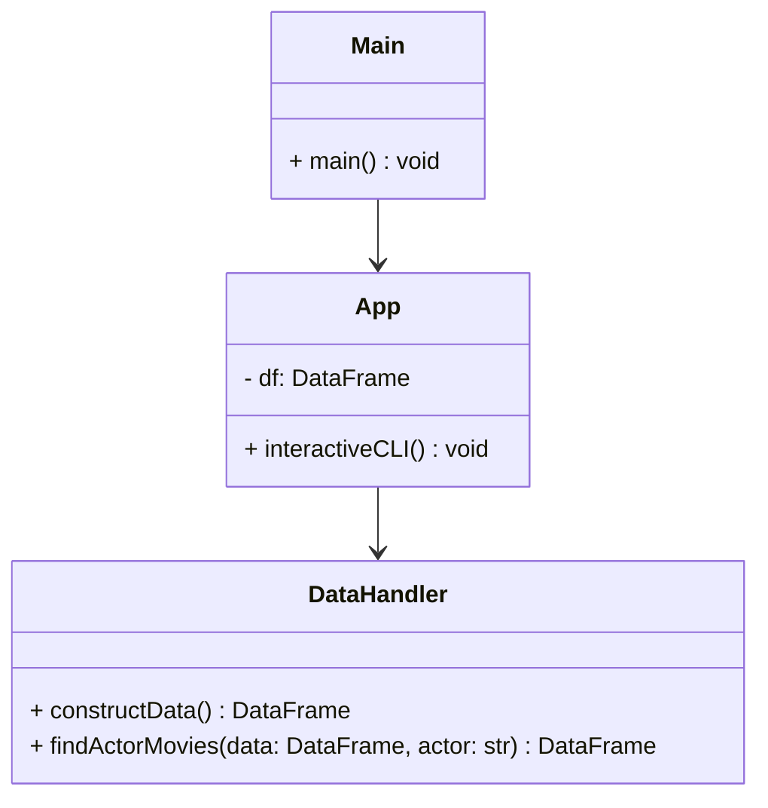

# ENSF692-Project
Data analysis group project. The purpose of the project is to combine 3 seperate (but related) data sets and create a UI for a user to query the combined dataset. 

members: Marley Cheema, Barrett Sapunjis 

Expected dataset: 

| Movie ID | Movie Name | Movie details.... | Actors | Actor details |
| -------- | ---------- | ----------------- | ------ | ------------- |
| 1        | inglorious bastards     |10/10                    | {actor 1, actor 2}      |  { 1984 , 1990}           |

there is a possiblity that the actors can be made into a hierarchial key and do not need to be in a list. 

- how to use:
   	- `pip install -r requirements.txt`
   	- `python .\main.py`

