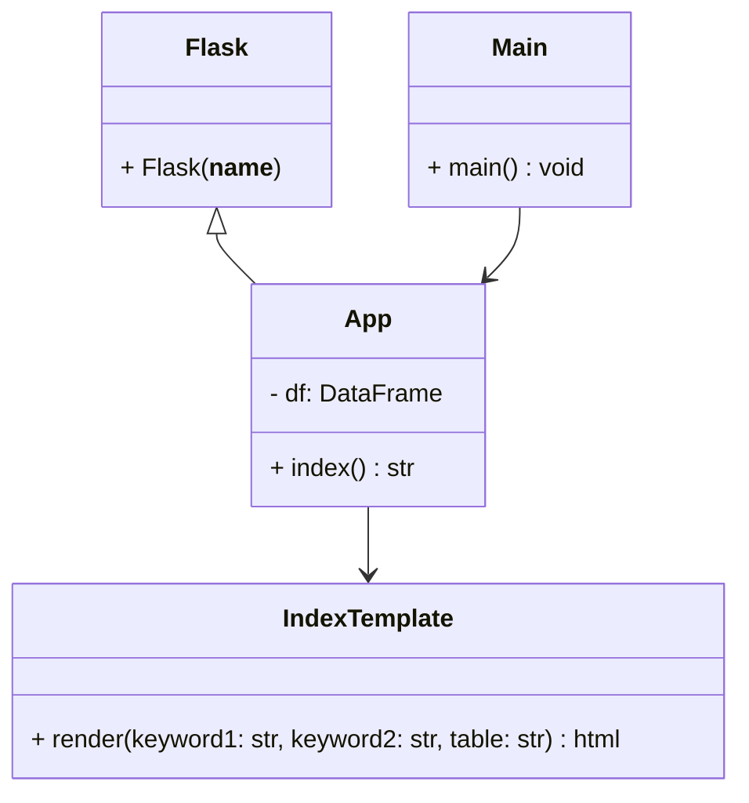

# ENSF692-Project
Data analysis group project. The purpose of the project is to combine 3 seperate (but related) data sets and create a UI for a user to query the combined dataset. 

members: Marley Cheema, Barrett Sapunjis 

Expected hierarchy: 

- **Team** (all NHL teams - 32 rows)
	- **Situation** (5v5, 4v5, 5v4, other, all - 5 rows per team)
		- **Stats** (# of players + 1 rows)
			- Contains player stats per situation
			- contains goalie stats per situation
			- contains total team stats per situation 

- how to use:
   	- `pip install -r requirements.txt`
   	- `python .\main.py`

