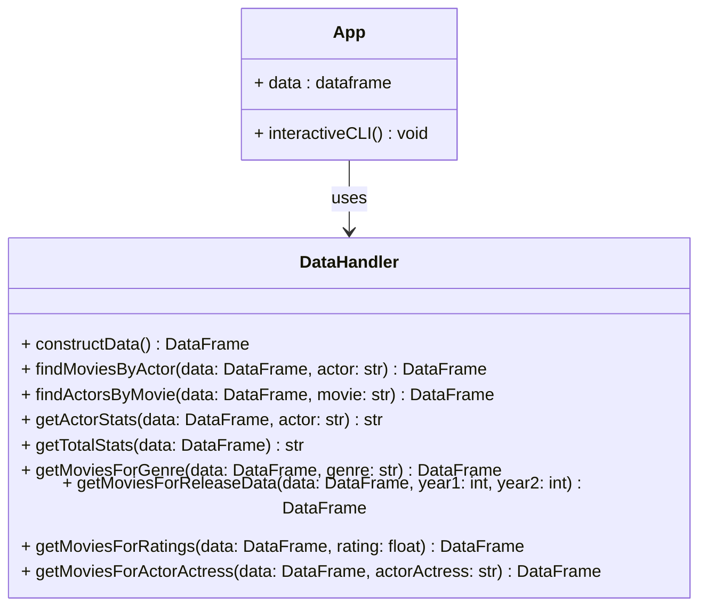

# ENSF692-Project
Data analysis group project. The purpose of the project is to combine 3 seperate (but related) data sets and create a UI for a user to query the combined dataset. 

members: Marley Cheema, Barrett Sapunjis 

Expected dataset: 

| Rating | startYear | Movie details.... | ActorsList | ActressList|
| -------- | ---------- | ----------------- | ------ | ------------- |
| 5      | 2016     |inglorious bastards        ....            | {actor 1, actor 2}      |  { actress 1, actress 2}           |

- how to use:
   	- `pip install -r requirements.txt`
    - `make sure to download/acquire the data sets that are not posted on git`
   	- `python .\app.py`

- testing 
    - point code to the testData2 folder instead and change the file name reference in the code. 
    - test with smaller data set. 

    

