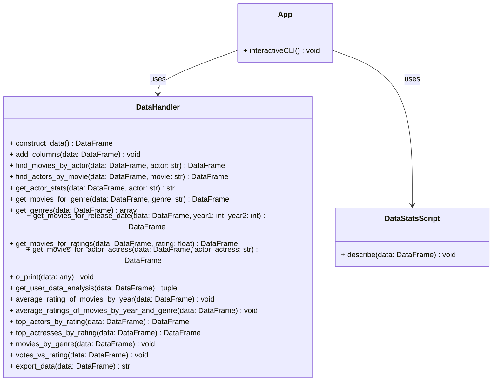

# ENSF692-Project
Data analysis group project. The purpose of the project is to combine 3 seperate (but related) data sets and create a UI for a user to query the combined dataset. 

members: Marley Cheema, Barrett Sapunjis 

The three datasets used are pulled directly from IMDB (https://datasets.imdbws.com/) and modified to a smaller form. They could not be saved as xlsx without losing data. 
- namesActorActressOnly.csv
   - originally: name.basics.tsv.gz
     - modified to only contain people whos role listed them as an actor or actress
- ratings.csv
    - originally: title.ratings.tsv.gz
    - Not modified
- titles1980.csv
    -  originaly: title.basics.tsv.gz
    -  modified to only contain information on all movies made since 1980
  
     

- how to use:
   	- `pip install -r requirements.txt`
    - `make sure to download/acquire the data sets that are not posted on git`
        - https://1drv.ms/f/c/46dad491737b36ce/EqEDtUPNf2NBsdptI45pQI0B6YA13g0AbrAMVde8SHsKIw?e=nK2J8O
   	- `python .\app.py`

    

